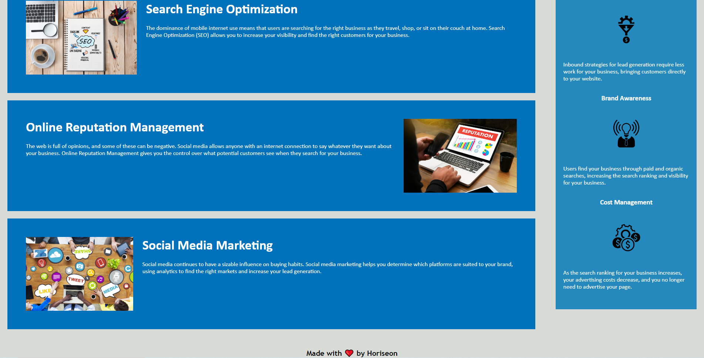

# Homework-1
This is the homework for week 1

## Overview - Description
The finished product has semantic elements for better accessibility purposes for people with disabilities using screen readers.
This is done using elements like sections, articles, and asides.
The nav bar was broken so that was fixed also.

## Location
Can be found at this link: (https://mckit77.github.io/homework-1/) 

Screenshots of finished product can be found here: 

